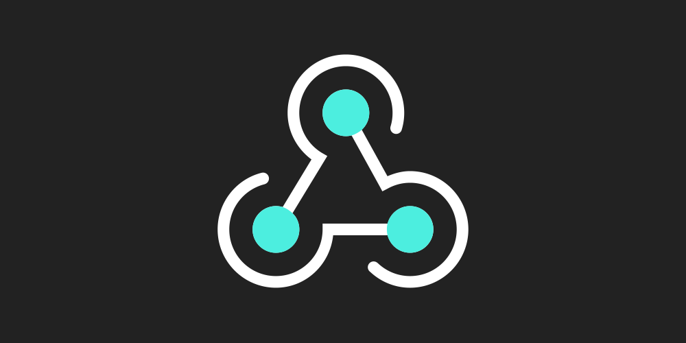

    

  

# 教程
- 首次运行会提示让用阿里云盘APP扫码登陆

- 需要先配置 `config.py` 文件及 

- 然后配置 `main.py` 中的 `db_export_config`, key 是文件名，value 中的 `db` 是 要备份的数据库的名字

- 然后 安装环境, `pip install -r requirements.txt`

- 首次运行需要先运行 `python main.py` 进行扫码登录

- 后面运行 `sh db_backup_auto_start.sh` 或者 `nohup python main.py &` 皆可

- 如有配置消息通知, 则消息中会包含: <strong>上传的文件名, 文件所在的目录名字, 文件下载链接, 云盘的剩余空间</strong>